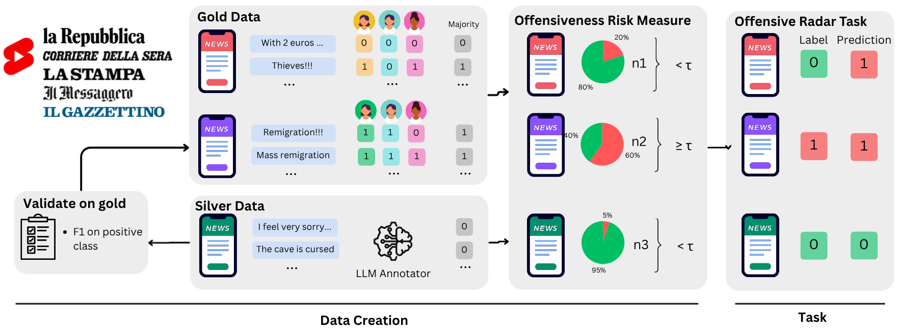

# Towards an Offensive-Radar

This repository contains the code to replicate the experiments from the paper "Before the Storm: Estimating Offensive Speech Risk from Italian News on YouTube".

Authors: Samuele D'Avenia, Eliana Di Palma, Lia Draetta, Soda Marem Lo and Marta Marchiori Manerba.

The full pipeline consists of a series of steps to create the data and test the proposed methodology and baselines.
We briefly describe the steps below and visualize them in the image:


## Repo structure

```
.
├── VideosComments/youtube  
├──── annotated_comments
├──── annotated_metadata 
├──── comments_anonymized
├──── metadata   
├── clean_anonymize_data.py
├── create_gold.py
├── create_plots.ipynb
├── create_silver_comments.py
├── create_silver_metadata.py
├── gather_yt_data_time_nested.py
├── offensiveradar_baselines.py
├── offensiveradar.py
├── prepare_offensiveradar_data.py
├── README.md
├── validate_silver_comments.py
└── validate_silver_metadata.py
```
Inside `annotated_comments`,`annotated_metadata` we have all files under `{newspaper}/{newspaper_video_id.csv/json}` respectively.

## Full Pipeline Description
The various scripts to obtain the full pipeline are briefly described here.
This code requires a Youtube data API key and a Huggingface Token to be placed inside a `.env` file, for scraping and modelling respectively.

0. `gather_yt_data_nested.py`
Code to scrape Youtube videos and reconstruct the full comment threads. The videos are placed in folder `VideosComments/youtube` with separate files for metadata and comments.

1. `clean_anonymize_data.py`
Code to remove all user ids from the data and place them in `VideosComments/youtube/anonymized_data` with the same structure.

2. `create_gold.py`
Code to aggregated annotations to produce `_gold` files which are placed in `annotated_comments, annotated_metadata` folders with `_gold` suffix.

3. `validate_silver_comments.py, validate_silver_metadata.py`
Code to use the gold data to select the best model on offensiveness classification and topic classification. 
The best model is selected on a dev split consisting of 60\% of gold videos and performance is reported on a held-out 40\% test set.

4. `create_silver_comments.py, create_silver_metadata.py`
Code to infer silver labels for both offensive classification (at the comment level) and topic classification (at the news article level).

5. `prepare_offensiveradar_data.py`
Code to collect all gold and silver data and place them in a single `.csv` file containing `video_id, newspaper, text, topic, percentage_offensive_comments, type`, with one entry per video.

6. `offensiveradar.py`
Code to run zero-shot classification on the Offensive-Radar Detection task.

7. `create_plots.ipynb`
Code to obtain the plots in the paper.
